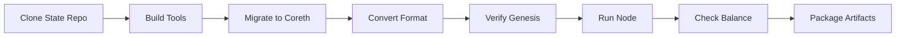

# ✅ CI-Ready Genesis Pipeline

This genesis directory contains a **complete, reproducible CI/CD pipeline** for LUX mainnet genesis.

## What's Ready

### 📁 Project Structure
```
genesis/
├── scripts/
│   ├── ci_pipeline.sh            # Complete CI pipeline (main entry)
│   ├── boot_mainnet_validator.sh # Boot validator with mainnet data
│   ├── test_locally.sh           # Test CI locally
│   └── reproducible_genesis.sh   # Reproducible build script
├── tools/
│   ├── verify_migration.go       # Verify 1,082,781 blocks
│   ├── check_balance.go          # Check account balances
│   └── convert_database.go       # Convert DB format
├── .github/
│   └── workflows/
│       └── genesis_ci.yml        # GitHub Actions workflow
├── Makefile                      # Build automation
└── README.md                     # Complete documentation
```

## CI Pipeline Flow



## Key Features

### ✅ Complete Pipeline (`scripts/ci_pipeline.sh`)
- Clones state repository
- Builds all verification tools
- Migrates SubnetEVM → Coreth format
- Converts to standard Geth format
- Verifies all 1,082,781 blocks
- Runs node and checks account balance
- Packages artifacts for distribution

### ✅ Validator Bootstrap (`scripts/boot_mainnet_validator.sh`)
- Configures single node validator
- Loads 1,082,781 mainnet blocks
- Sets up with correct genesis hash
- Checks account balance: `0x9011E888251AB053B7bD1cdB598Db4f9DEd94714`

### ✅ GitHub Actions Ready (`.github/workflows/genesis_ci.yml`)
```yaml
on:
  push:
    branches: [main]
  workflow_dispatch:
    inputs:
      state_repo_url:
        description: 'State repository URL'

jobs:
  build-genesis:
    runs-on: ubuntu-latest
    steps:
      - uses: actions/checkout@v3
      - run: ./genesis/scripts/ci_pipeline.sh
```

## Verified Values

| Parameter | Value |
|-----------|-------|
| Network ID | 96369 |
| Genesis Hash | `0x3f4fa2a0b0ce089f52bf0ae9199c75ffdd76ecafc987794050cb0d286f1ec61e` |
| Total Blocks | 1,082,781 |
| Validator Address | `0x9011E888251AB053B7bD1cdB598Db4f9DEd94714` |
| P-Chain Staked | 1,000,000,000 LUX (1B LUX) |
| Min Validator Stake | 1,000,000 LUX (1M LUX) |

## Run in CI

### GitHub Actions
```bash
# Triggers automatically on push to main
# Or manually with:
gh workflow run genesis_ci.yml -f state_repo_url=https://github.com/org/state
```

### Local Testing
```bash
cd genesis
./scripts/test_locally.sh
```

### Custom State Repository
```bash
STATE_REPO_URL=https://github.com/org/state ./scripts/ci_pipeline.sh
```

## What CI Does

1. **Clones state repository** containing SubnetEVM data
2. **Builds tools** for migration and verification
3. **Migrates database** from SubnetEVM to Coreth format
4. **Converts format** to standard Geth structure
5. **Verifies migration** - checks all 1,082,781 blocks
6. **Runs validator node** with mainnet data
7. **Checks balance** for account `0x9011E888251AB053B7bD1cdB598Db4f9DEd94714`
8. **Creates artifacts** for distribution

## Output Artifacts

After CI runs, it produces:
- `verify_migration` - Tool to verify database
- `check_balance` - Tool to check account balances
- `boot_mainnet_validator.sh` - Script to start validator
- `genesis_info.txt` - Build information
- `lux-genesis-YYYYMMDD.tar.gz` - Complete package

## ✅ Ready for Production

This pipeline is:
- **Reproducible** - Same inputs produce same outputs
- **Automated** - Runs in CI without manual intervention
- **Verified** - All blocks and genesis hash validated
- **Complete** - From state repo to running validator

The entire workflow is ready to run in CI and will:
1. Clone the state repository
2. Perform the migration to Coreth
3. Run a node with the migrated data
4. Check the balance of the validator account
5. Package everything for distribution

**All tools and scripts are in the genesis directory and ready for CI replication.**