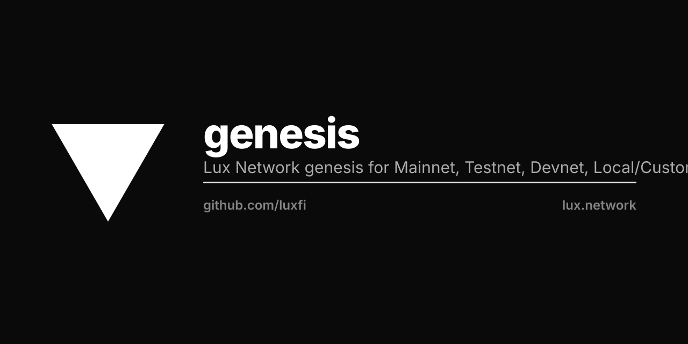

<p align="center"></p>

# Lux Network Genesis Configurations

This repository contains the canonical genesis configurations for all Lux networks.

## Directory Structure

```
configs/
├── mainnet/             # network 1, C-Chain 96369 — recorded
│   ├── genesis.json     # the genesis its validators boot, byte for byte
│   ├── upgrade.json
│   └── bootstrappers.json
├── testnet/             # network 2, C-Chain 96368 — recorded
│   └── …                # the same three files
├── devnet/              # network 3, C-Chain 96367 — assembled
│   ├── network.json
│   ├── pchain.json
│   └── {x,c,d,q,a,b,f,z,g,k,m}chain.json
└── localnet/            # network 1337, C-Chain 31337 — assembled
```

## Recorded and assembled networks

A network with history cannot have its genesis changed: the bytes are its
identity — every blockchain ID, the staker set, and the units every balance
since block 0 is denominated in. So **mainnet and testnet are recorded**:
`genesis.json` is the document in their `luxd-genesis` ConfigMap, and
`GetGenesis` returns it byte for byte. A node started without `--genesis-file`
joins the running network — C-Chain `2Hx3UMuW…` with block 0 `0x3f4fa2a0…` on
mainnet, `5kjSQWfw…` with block 0 `0x1c5fe377…` on testnet. Both are 9-decimal
by birth, and allocations handed to them are refused.

**devnet, localnet and new networks are assembled** from `network.json`,
`pchain.json` and one shard per chain, in 6-decimal units. A shard present is a
chain in genesis; a shard absent is not.

## Mainnet C-Chain Genesis

The mainnet C-Chain was initialized with a single genesis allocation:

| Address | Balance |
|---------|---------|
| `0x9011e888251ab053b7bd1cdb598db4f9ded94714` | 2,000,000,000,000,000,000,000,000,000,000 wei (2T LUX) |

### Key Parameters

- **Chain ID**: 96369
- **Gas Limit**: 12,000,000 (0xB71B00)
- **Min Base Fee**: 25 gwei
- **Block Rate**: 2 seconds

## Network IDs

| Network | Chain ID | Network ID | Purpose |
|---------|----------|------------|---------|
| LUX Mainnet | 96369 | 1 | Production network |
| LUX Testnet | 96368 | 2 | Public test network |
| LUX Devnet | 96367 | 3 | Fast iteration dev network |
| Local | 31337 | 1337 | Local development |

## Network Configurations

### Mainnet (96369)
- **Block Rate**: 2 seconds
- **Gas Limit**: 12M
- **Min Base Fee**: 25 gwei
- **Genesis Account**: `0x9011...` with 2T LUX

### Testnet (96368)
- **Block Rate**: 2 seconds
- **Gas Limit**: 12M
- **Min Base Fee**: 25 gwei
- **Genesis Account**: `0x9011...` with 2T LUX (same as mainnet)

### Devnet (96367)
- **Block Rate**: 1 second (faster)
- **Gas Limit**: 20M
- **Min Base Fee**: 1 gwei (cheaper)
- **Genesis Account**: `0x9011...` with 2T LUX
- All upgrades enabled at genesis (Shanghai, Cancun, etc.)

### Local (1337)
- **Block Rate**: 1 second
- **Gas Limit**: 15M
- **Min Base Fee**: 1 gwei
- **Genesis Account**: `0x9011...` with 2T LUX
- All upgrades enabled at genesis

## Usage

These genesis files are used by:
- `luxd` node for network initialization
- `coreth` for C-Chain configuration
- Block explorers for genesis block verification
- Migration tools for state reconstruction

## RPC Endpoints

`/v1` is luxd's only HTTP prefix (`node/server/http/server.go`, `baseURL`).
The port differs per fleet — read `spec.ports.http` off that net's
`LuxNetwork` CR, never assume one:

- **Mainnet**: `http://localhost:9630/v1/chain/c/rpc`
- **Testnet**: `http://localhost:9640/v1/chain/c/rpc`
- **Devnet**: `http://localhost:9650/v1/chain/c/rpc`

## Genesis Account

All networks use the same production genesis account:

| Account | Balance | Networks |
|---------|---------|----------|
| `0x9011e888251ab053b7bd1cdb598db4f9ded94714` | 2T LUX | All networks |

## State Data & RLP Exports

Blockchain state exports and RLP-encoded blocks are maintained in a separate repository:

**Repository**: [github.com/luxfi/state](https://github.com/luxfi/state)

### Available Data

| Network | Chain ID | Blocks | RLP Location |
|---------|----------|--------|--------------|
| Lux Mainnet | 96369 | 1,082,780 | `rlp/lux-mainnet/lux-mainnet-96369.rlp` |
| Lux Testnet | 96368 | 219 | `rlp/lux-testnet/lux-testnet-96368.rlp` |
| Zoo Mainnet | 200200 | 799 | `rlp/zoo-mainnet/zoo-mainnet-200200.rlp` |
| Zoo Testnet | 200201 | 85 | `rlp/zoo-testnet/zoo-testnet-200201.rlp` |

### Import Workflow

```bash
# Clone repos
git clone https://github.com/luxfi/genesis
git clone https://github.com/luxfi/state

# Initialize with genesis
jq -r .cChainGenesis genesis/configs/mainnet/genesis.json > cchain.json
geth init --datadir /path/to/db cchain.json

# Import blocks from state repo
geth import --datadir /path/to/db state/rlp/lux-mainnet/lux-mainnet-96369.rlp
```

### Source Data

The state repo also contains:
- `pebbledb/` - Original SubnetEVM PebbleDB databases
- `docs/` - State verification and recovery documentation
- `pkg/` - Go tools for archaeology, bridge, and scanning
