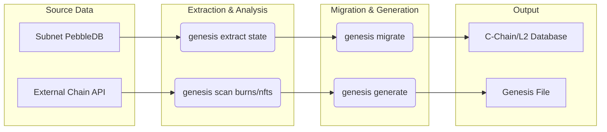

# 4. Advanced Guide: Blockchain Data Migration

This guide provides a comprehensive overview of migrating historical blockchain data for the Lux Network. This is an advanced topic, critical for ensuring chain continuity and preserving user assets from previous network iterations or external chains.



## The Core Problem: Migrating Subnet Data

The Lux C-Chain (ID 96369) was originally a Subnet EVM. Subnet databases have a different structure than the primary C-Chain database. The migration process bridges this gap.

**Key Challenges Discovered in Real-World Data:**

During the migration of the Lux mainnet, several issues were found in the source data that the `genesis` tools are now designed to handle:

1.  **State-Only Data**: The archived subnet database contained all account balances and contract data (the "state") but was missing the historical blocks, transactions, and receipts.
2.  **Inconsistent Key Formats**: The keys used to map block numbers to block hashes (`n` keys) were stored in a truncated format, making it impossible to rebuild the chain's history directly.
3.  **Missing Consensus Data**: Subnet databases lack the "Snowman" consensus metadata that the primary C-Chain requires to understand block relationships.

The `genesis` toolset was built to overcome these specific, real-world challenges.

## Migration Path: C-Chain or L2?

When migrating a subnet, you have two primary destinations:

1.  **Migrate to C-Chain**: Promote the subnet to become the primary C-Chain of the network. This involves adding a 32-byte blockchain ID prefix to every key in the database.
2.  **Migrate to L2**: Keep the subnet as an L2. This preserves the original key structure and is the standard path for subnets like ZOO and SPC.

The `genesis migrate` command family has different subcommands to handle these distinct paths.

---

## Workflow 1: Migrating a Subnet to the C-Chain

This workflow details the complete end-to-end process of taking a raw Subnet-EVM PebbleDB, fixing its key formats, importing its data, and launching a fully-bootstrapped C-Chain node.

This is based on the actual runbook developed to migrate chain 96369.

### Prerequisites

-   A source Subnet EVM database (PebbleDB).
-   The `genesis` CLI tool.
-   Sufficient disk space (~2x the DB size).

### The Migration Pipeline

The `genesis` tool provides commands to run this pipeline step-by-step, which is essential for debugging.

**Step 1: Extract and De-namespace the State**

This step copies the data while stripping the 33-byte namespace prefix that subnets use.

```bash
# The `extract state` command is the modern replacement for the old `namespace` tool.
./bin/genesis extract state \
    /path/to/source/subnet/pebbledb \
    /tmp/extracted-data \
    --network 96369 \
    --state
```

**Step 2: Repair Canonical Mappings**

This is the most critical step. It addresses the "truncated key" problem by rebuilding the canonical mappings between block numbers and block hashes.

```bash
# This command inspects headers and rebuilds the 'n' and 'H' keys correctly.
./bin/genesis repair canonical --db /tmp/extracted-data/pebbledb
```

**Step 3: Replay Consensus State**

This step creates the synthetic Snowman consensus data required by the C-Chain. It walks the chain of blocks and generates the necessary metadata for the consensus engine.

```bash
# Find the tip of the chain first
export TIP=$(./bin/genesis inspect tip --db /tmp/extracted-data/pebbledb)

# Replay consensus up to the tip
./bin/genesis repair snowman \
    --evm-db /tmp/extracted-data/pebbledb \
    --state-db /tmp/consensus-state/pebbledb \
    --tip $TIP
```
*Note: The `repair snowman` command replaces the older `replay-consensus-pebble` tool.*

**Step 4: Launch the Node with Migrated Data**

You can now launch a `luxd` node pointing to the directory containing the repaired EVM data and the new consensus state data.

```bash
./bin/genesis launch migrated \
    --data-dir /tmp/migrated-data \
    --network-id 96369
```

**Step 5: Verify**

After launching, use RPC calls to verify the migration was successful. The block number should match the tip from Step 3, and you should be able to query account balances.

```bash
# Check block number (should be > 0)
curl -s --data '{"jsonrpc":"2.0","method":"eth_blockNumber","params":[],"id":1}' \
  http://localhost:9630/ext/bc/C/rpc

# Check treasury balance
curl -s --data '{"jsonrpc":"2.0","method":"eth_getBalance","params":["0x9011e888251ab053b7bd1cdb598db4f9ded94714","latest"],"id":1}' \
  http://localhost:9630/ext/bc/C/rpc
```

---

## Workflow 2: Cross-Chain Migration (ZOO from BSC)

This workflow shows how to incorporate data from an external chain into a new genesis file.

### The Goal

Create a genesis file for the ZOO L2 that includes:
1.  Balances for users who burned ZOO tokens on the Binance Smart Chain (BSC).
2.  A large ZOO allocation for every user who holds a specific "EGG" NFT on BSC.

### The Process

**Step 1: Scan BSC for Burn Events**

Use the `scan` command to find all transactions sent to the burn address and create a CSV of addresses and amounts.

```bash
./bin/genesis scan token-burns \
    --chain bsc \
    --token 0x0a6045b79151d0a54dbd5227082445750a023af2 \
    --burn-address 0x000000000000000000000000000000000000dEaD \
    --output exports/zoo-bsc-burns.csv
```

**Step 2: Scan BSC for NFT Holders**

Use the `scan` command again to find all owners of the EGG NFT.

```bash
./bin/genesis scan nft-holders \
    --chain bsc \
    --contract 0x5bb68cf06289d54efde25155c88003be685356a8 \
    --output exports/egg-nft-holders.csv
```

**Step 3: Generate Migration Allocations**

Use the specialized `zoo-migrate` command to process these files according to the specific business logic (1 burn = 1 credit, 1 EGG = 4.2M ZOO).

```bash
./bin/genesis migrate zoo-migrate \
    --burns-csv exports/zoo-bsc-burns.csv \
    --eggs-csv exports/egg-nft-holders.csv \
    --output genesis/zoo-allocations.json
```

**Step 4: Create the Final Genesis File**

Finally, run the `generate` command, importing these processed allocations to create the final `genesis.json` for the ZOO network.

```bash
./bin/genesis generate \
    --network zoo-mainnet \
    --import-allocations genesis/zoo-allocations.json
```
